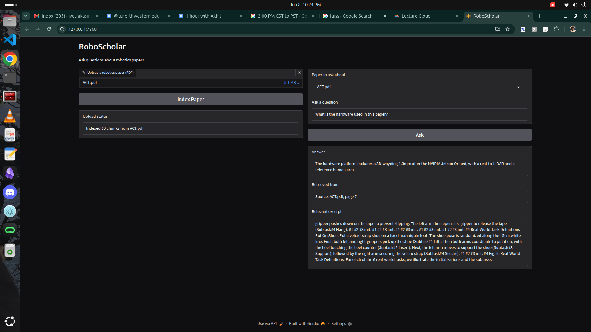

# RoboScholar

A robotics paper Q&A system built around a **from-scratch decoder-only transformer**, paired with a **RAG pipeline** that retrieves relevant passages from uploaded papers, a Gradio UI, and source attribution for explainability.

Upload a robotics paper, ask a question, and the system retrieves the most relevant passage from the paper and generates an answer grounded in that context — while showing you exactly which excerpt it used.

## Setup

```bash
# 1. Create the environment (installs all pinned deps + the project in editable mode)
uv sync
source .venv/bin/activate

# 2. Download the trained model checkpoint from HuggingFace Hub
hf download <username>/roboscholar-checkpoint checkpoint_epoch_8.pt --local-dir checkpoints/

# 3. Launch the app
python src/app.py
```

The Gradio UI opens at `http://localhost:7860`

> The checkpoint (~199 MB) is hosted on HuggingFace Hub rather than git, since it exceeds GitHub's 100 MB file limit.

## How It Works

```
Upload PDF ─→ chunk ─→ embed ─→ FAISS index   (build the searchable knowledge base)

Question ─→ embed ─→ FAISS search ─→ top chunk ─→ build prompt ─→ transformer ─→ answer
                                         │
                                         └─→ shown to user as the "relevant excerpt" (source attribution)
```

## The Transformer (from scratch)

A GPT-style decoder-only transformer, implemented from scratch in PyTorch (`src/model/`).

| Component | Detail |
|---|---|
| Architecture | Decoder-only (causal), no cross-attention |
| Layers | 6 transformer blocks |
| Model dim (`d_model`) | 512 |
| Attention heads | 8 (64 dims per head) |
| Feed-forward | 4× expansion with GELU |
| Positional encoding | Sinusoidal (fixed) |
| Context length | 512 tokens |
| Parameters | ~50M |

**Tokenizer** — a custom ByteLevel BPE tokenizer (`tokenizers`) trained on the robotics-paper corpus, 32k vocab. Special tokens: `<pad>=0`, `<sos>=1`, `<eos>=2`, `<unk>=3`, `<sep>=32000` (vocab size 32001).

**Training format** — each example is a single sequence:
```
<sos> context <sep> question <sep> answer <eos>
```
Loss is computed **only on the answer tokens** (everything before the answer is masked with `-100`), so the model learns to generate answers conditioned on the context and question. Trained with teacher forcing and cross-entropy loss. The released checkpoint is epoch 8, selected by early stopping on validation loss.

**Generation** — autoregressive decoding with temperature, top-k sampling, and a repetition penalty to avoid degenerate loops (`src/inference.py`).

## The RAG Pipeline

Located in `src/rag/`. At inference the `relevant_excerpt` used during training is replaced by a passage retrieved live from the uploaded paper.

| Stage | Detail |
|---|---|
| PDF parsing | PyMuPDF (`fitz`), text extracted page by page |
| Chunking | ~256-word sliding windows with 50-word overlap, each tagged with source file + page |
| Embeddings | `sentence-transformers` `all-MiniLM-L6-v2` (384-dim) |
| Vector store | FAISS `IndexFlatL2`, persisted to disk (`data/vector_store/`) |
| Retrieval | top-k nearest chunks by L2 distance |

The index is **dynamic and persistent** — uploading a paper chunks, embeds, and adds it to the FAISS index, which is saved to disk and reloaded across sessions. Re-uploading a paper that's already indexed is skipped (dedup by filename).

Every chunk carries its `source` filename and `page` number, so the UI can show which passage an answer was grounded in.

## Dataset Generation

There is no off-the-shelf Q&A dataset for robotics papers, so it was **synthetically generated** from real arXiv papers. The pipeline scrapes full-text robotics papers from arXiv, then uses a local LLM (`llama3.1:8b` via Ollama) to read each paper and produce grounded question-answer triples. Crucially, each triple includes a `relevant_excerpt` — a verbatim quote from the paper that supports the answer — which becomes the context the transformer is trained to condition on. This mirrors the inference-time setup, where that excerpt is instead supplied by the RAG retriever. The result is ~11k `(context, question, answer)` examples derived entirely from real robotics literature.

### 1. Scrape Papers

Fetches full robotics papers (cs.RO) from arXiv via the OAI-PMH bulk API, downloads and parses full PDFs with PyMuPDF. Saves to `data/raw/papers.jsonl`.

```bash
python scripts/data/arxiv_scrapper.py
```

### 2. Generate Q&A Pairs

Uses `llama3.1:8b` via Ollama to generate 3 question-answer pairs per paper. Each triple contains a `question`, `answer`, and `relevant_excerpt` (a direct quote supporting the answer — the context the model is trained on). Saves to `data/qa_pairs/qa_pairs.jsonl`.

```bash
ollama pull llama3.1:8b
python scripts/data/qa_generator.py
```

> Run both scripts in a tmux session for overnight execution. Resume support is built in — both skip already-processed entries on restart.

## Training

```bash
python src/train.py
```

Configuration is managed with Hydra (`configs/config.yaml`); experiments are tracked with Weights & Biases.

## Demo



<!-- Upload your demo video here -->

_Example: upload the [UMI paper](https://umi-gripper.github.io/umi.pdf), select it in the dropdown, and ask **"What sensor does the UMI gripper use?"** — the system retrieves the passage describing UMI's hardware (a handheld gripper with a GoPro camera as its only sensor) and surfaces it as the relevant excerpt. Uploading multiple papers and switching the dropdown scopes retrieval to the selected paper, so the same question pulls from the right source._

## Limitations & Future Work

- **PDF extraction noise** — text is extracted with PyMuPDF without structural parsing, so figure captions, table contents, and artifacts (e.g. `Fig. 6:`, `#1 #2 #3 init.`) end up in chunks. Because caption text is noun-dense, it sometimes ranks highly in retrieval. A structured parser (Docling/Marker → markdown) or a chunk quality filter would separate body text from captions.
- **Generation quality** — the from-scratch model is small (~50M params) and trained on ~11k synthetic Q&A pairs, so generated answers are rough; the retrieved excerpt is the more reliable output. A larger model and more data would improve fluency.
- **Multi-chunk context** — only the single best-matching chunk is fed to the model. Concatenating the top-k chunks (within the 512-token budget) would give the model more to ground on.
